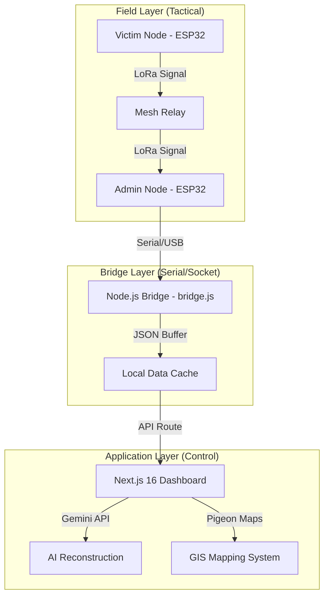

# Aerolink Basecamp: Tactical Disaster Response Portal

[](https://opensource.org/licenses/MIT)
[]()
[]()

## 🛰 Overview
**Aerolink Basecamp** is an industry-grade, tactical Command & Control (C2) platform designed for mission-critical disaster management. It bridges the gap between field-level fragmented signals and high-level medical/rescue coordination through a combination of **LoRa mesh networking**, **Generative AI reconstruction**, and **GIS situational mapping**.

In environments where cellular infrastructure has collapsed, Aerolink provides a resilient backbone for extracting, decoding, and prioritizing SOS signals to ensure every second counts in that kind of environment.

---

## 🚀 Core Pillars

### 1. LoRa Mesh Tactical Networking
The system utilizes **SX1278 LoRa modules** paired with high-gain antennas to establish a long-range, low-power mesh network. 
- **Signal Interception**: Captures raw byte-streams from field-deployed ESP32 nodes.
- **Resilient Bridge**: A custom Node.js bridge (`bridge.js`) handles bidirectional serial-to-web uplinks, allowing the Base Station to function as the primary sink for all mesh traffic.

### 2. AI/ML Intelligence Engine
Fragmented or corrupted signals are processed via the **Gemini 1.5 Intelligence Module**.
- **Neural Reconstruction**: Decodes highly compressed or typo-heavy Morse/Text inputs into professional emergency reports.
- **Priority Board**: Uses Machine Learning to score incoming signals based on medical urgency, hazard levels, and casualty counts, automatically moving critical cases to the top of the rescue queue.

### 3. GIS Tactical Mapping
Full spatial awareness is integrated using **SituationalMap (Pigeon-Maps Integration)**.
- **Haversine Distance Tracking**: Automatically calculates the exact distance between the Command Center (Admin Node) and the victim.
- **Live Geolocation**: Anchors the Base Station using browser-level Geolocation APIs and renders dynamic victim markers with real-time status pulses.

---

## 🏗 System Architecture

The project follows a clean, modular architecture designed for high availability and low latency:



---

## 🛠 Tech Stack

- **Framework**: [Next.js 16 (App Router)](https://nextjs.org/)
- **UI Architecture**: Tailwind CSS + Lucid Design Tokens
- **Icons**: Lucide-React
- **Mapping**: Pigeon Maps (Lightweight OSM integration)
- **Intelligence**: Google Gemini 1.5 Flash (Generative Intelligence)
- **Runtime**: Node.js & SerialPort Interfacing

---

## ⚙️ Setup & Execution

### 1. Environment Configuration
Create a `.env.local` file in the root directory:
```env
NEXT_PUBLIC_GEMINI_API_KEY=your_gemini_api_key
ENCRYPTION_KEY=tactical_key_here
```

### 2. Physical Bridge Setup
Connect your ESP32 Master Node to the COM port and start the bridge:
```bash
node scripts/bridge.js COM12 # Replace with your COM port
```

### 3. Web Dashboard
Install dependencies and launch the tactical portal:
```bash
npm install
npm run dev
```
Open [http://localhost:3000](http://localhost:3000) to access the **Basecamp Command Center**.

---

## 🛡 Security & Resilience
- **Status Markers**: Bidirectional feedback ensures field nodes receive visual acknowledgment (LED/OLED) when a signal is "Read" or "Forces En Route".
- **Local Persistence**: AI logs and dispatcher notes are cached to ensure continuity during temporary uplink failures.

---
*Developed for tactical emergency response and high-stakes rescue coordination.*
