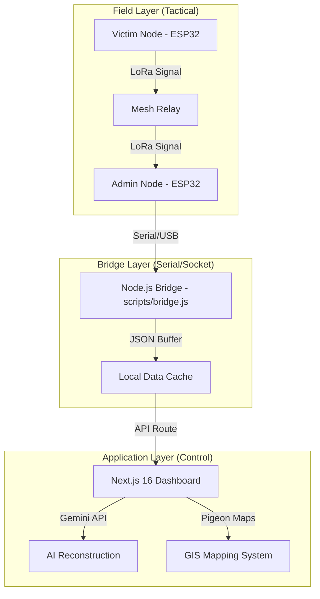

# Aerolink Basecamp: Tactical Disaster Response Portal

[](https://opensource.org/licenses/MIT)
[]()
[]()

## 🛰 Overview
**Aerolink Basecamp** is an industry-grade, tactical Command & Control (C2) platform designed for mission-critical disaster management. It bridges the gap between field-level fragmented signals and high-level medical/rescue coordination through a combination of **LoRa mesh networking**, **Generative AI reconstruction**, and **GIS situational mapping**.

In environments where cellular infrastructure has collapsed, Aerolink provides a resilient backbone for extracting, decoding, and prioritizing SOS signals to ensure every second counts.

---

## 🚀 Core Pillars

### 1. LoRa Mesh Tactical Networking
The system utilizes **SX1278 LoRa modules** paired with high-gain antennas to establish a long-range, low-power mesh network. 
- **Signal Interception**: Captures raw byte-streams from field-deployed ESP32 nodes.
- **Resilient Bridge**: A custom Node.js bridge (`bridge.js`) handles bidirectional serial-to-web uplinks, allowing the Base Station to function as the primary sink for all mesh traffic.

### 2. AI/ML Intelligence Engine
Fragmented or corrupted signals are processed via the **Gemini 2.5 Flash Intelligence Module**.
- **Neural Reconstruction**: Decodes highly compressed or typo-heavy Morse/Text inputs into professional emergency reports.
- **Priority Board**: Uses Machine Learning to score incoming signals based on medical urgency, hazard levels, and casualty counts, automatically moving critical cases to the top of the rescue queue.

### 3. GIS Tactical Mapping
Full spatial awareness is integrated using **SituationalMap (Pigeon-Maps Integration)**.
- **Haversine Distance Tracking**: Automatically calculates the exact distance between the Command Center (Admin Node) and the victim.
- **Live Geolocation**: Anchors the Base Station using browser-level Geolocation APIs and renders dynamic victim markers with real-time status pulses.

---

## 🏗 System Architecture

The project follows a clean, modular architecture designed for high availability and low latency:



---

## 📂 Project Organization

```
Aerolink/
├── hardware/
│   └── transceiver.ino        # ESP32 C++ source code for Wi-Fi/UDP mesh communications
├── public/
│   └── logo.png               # Brand identity assets
├── scratch/
│   └── wifi_to_serial.js      # TCP socket bridge tool for testing mobile device inputs
├── scripts/
│   └── bridge.js              # Node.js duplex bridge (Serial Port COM12 <-> Web Dashboard API)
├── src/
│   ├── app/                   # Next.js App Router (Layouts, globals, pages, and REST APIs)
│   ├── components/            # React UI components (Dashboard, priority boards, maps)
│   ├── data/                  # Local cache buffers (ignored ticket DB files)
│   └── lib/                   # Shared utility modules (encryption, auth, database, Gemini AI)
├── .env.example               # Template environment configuration
├── .gitignore                 # Safe tracking configurations
└── README.md & AGENTS.md      # Command Center setup and agent developer rules
```

---

## 🛠 Tech Stack

- **Framework**: [Next.js 16 (App Router)](https://nextjs.org/)
- **UI Architecture**: Tailwind CSS + Vanilla CSS Layouts
- **Icons**: Lucide-React
- **Mapping**: Pigeon Maps (Lightweight OpenStreetMap integration)
- **Intelligence**: Google Gemini 2.5 Flash (Generative Intelligence & Triage Grading)
- **Runtime**: Node.js & SerialPort Interfacing

---

## ⚙️ Setup & Execution

### 1. Environment Configuration
1. Copy the sample environment template:
   ```bash
   cp .env.example .env.local
   ```
2. Populate the `.env.local` file with your credentials:
   ```env
   GEMINI_API_KEY=your_gemini_api_key_here
   ADMIN_USERNAME=basecamp
   ADMIN_PASSWORD=Aerolink2026
   ENCRYPTION_KEY=emergency-dispatch-secure-key-32
   ```

### 2. Physical Bridge Setup
Connect your ESP32 Master Node via USB to the base station computer. Find the COM port and launch the Node bridge:
```bash
node scripts/bridge.js COM12 # Replace with your COM port (e.g., COM3, /dev/ttyUSB0)
```

### 3. Web Dashboard
Install frontend dependencies and start the local development server:
```bash
npm install
npm run dev
```
Open [http://localhost:3000](http://localhost:3000) to access the **Basecamp Command Center**.

---

## 🛡 Security & Resilience
* **AES-256-CBC Encryption**: Local JSON databases are encrypted symmetrically via custom db adapters (`src/lib/db.ts` & `src/lib/encryption.ts`) to secure user records and coordinates against physical extraction.
* **Status Markers**: Bidirectional feedback loop ensures field nodes receive visual acknowledgment (LED/OLED updates) when a signal has been read or dispatch teams are en route.
* **Local Persistence**: AI logs and dispatcher notes are cached to ensure continuity during temporary uplink failures.

---
*Developed for tactical emergency response and high-stakes rescue coordination.*
